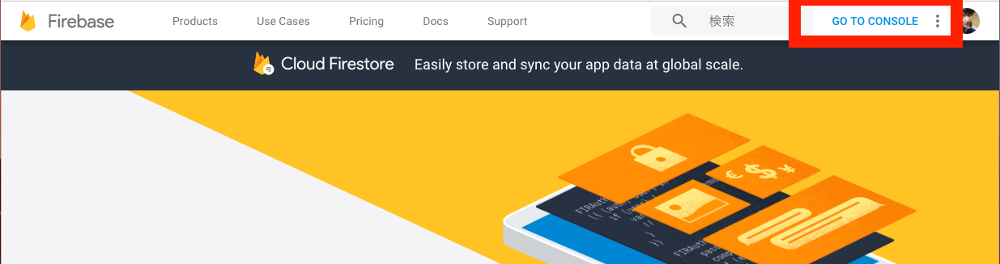
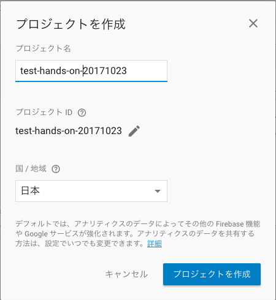
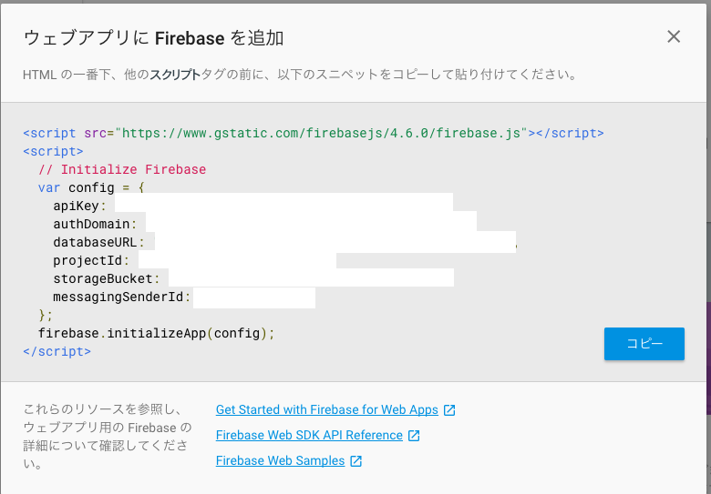
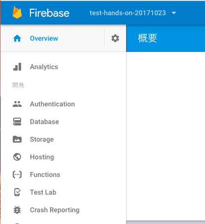
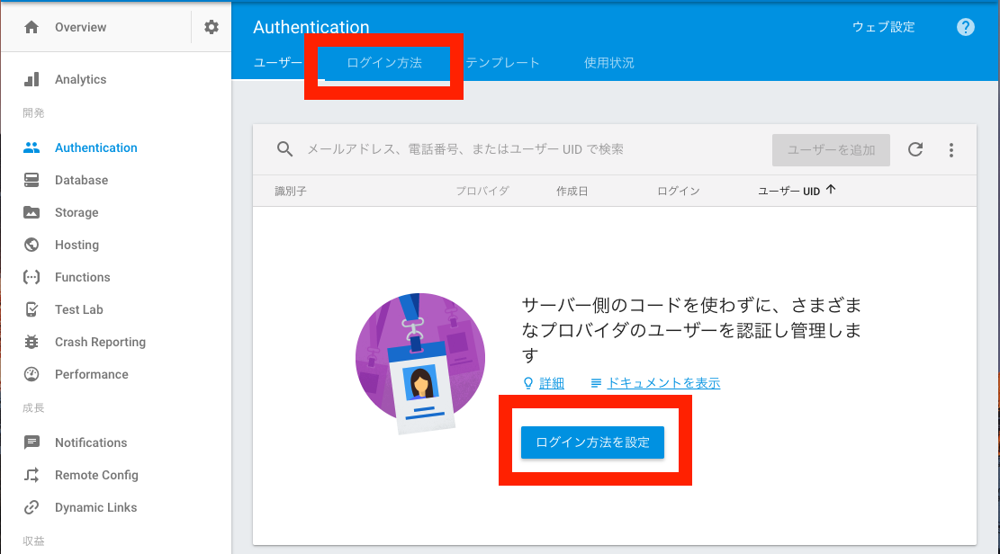
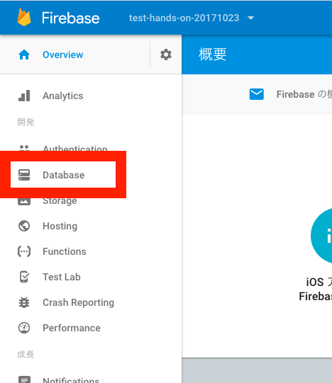
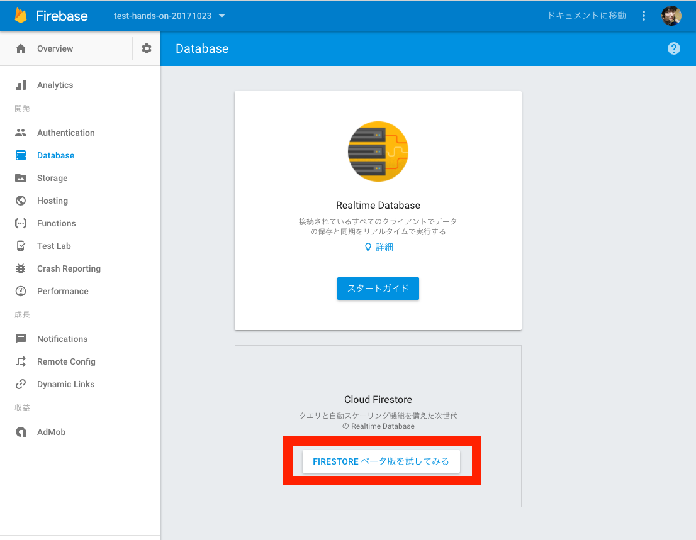
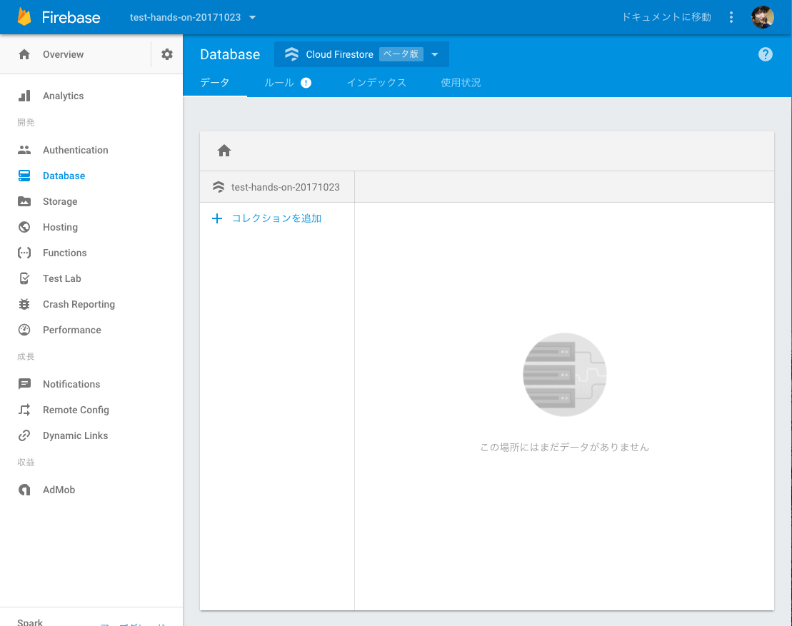
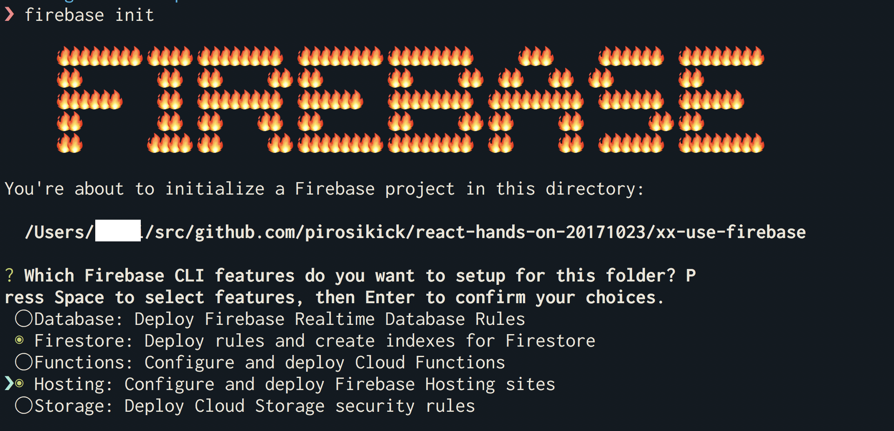

<!-- vim: set nofoldenable: -->

# firebaseを使う

firebaseを使って、下記を実現しましょう

- Googleアカウントでログイン出来るようにする
- チャットのデータを永続的に保存する

## 手順

1. firebaseのコンソールにログインし、プロジェクトを作成する
1. GoogleアカウントによるSNS認証を有効化する
1. firestoreを有効化し、データの書き込み・読み込みを許可する
1. firebase-toolsをインストールし、CLIからログインする
1. firebaseのSDKをインストールする
1. ログイン機能を実装する
1. 部屋情報、チャット情報をfirestoreに保存し、読み出す

### firebaseのコンソールにログインし、プロジェクトを作成する

https://firebase.google.com/?hl=ja



上記URLにアクセスし、右上の「GO TO CONSOLE」をクリックします。
「Firebaseへようこそ」の画面にたどり着いたら、「プロジェクトを追加」のボタンを押します。


「プロジェクトを作成」というダイアログが出ますので、プロジェクト名は適当、国/地域は「日本」を入力し、【プロジェクトを作成」ボタンを押します。



下記画面が表示されれば、プロジェクト作成完了です。
「ウェブアプリに Firebase を追加」を押すと、firebaseの認証情報が表示されます（あとで使います）



### GoogleアカウントによるSNS認証を有効化する

デフォルトでは無効になっているので、コンソールから有効にします。さきほど作ったプロジェクトページを開きます。
左にメニューが表示されているので、「Authentication」をクリックします。



下記のような画面が表示されるので、タブの「ログイン方法」か、真ん中あたりに表示される「ログイン方法を設定」のボタンを押します。



「ログイン プロバイダ」の「Google」をクリックします。


ダイアログが開くので、「有効にする」のスイッチをオンにします。下記の画像がオンの状態です。


### firestoreを有効化し、データの書き込み・読み込みを許可する

プロジェクトページの左メニューの「Database」をクリックします。



下に表示される「FIRESTOREベータ版を試してみる」をクリックします



「Cloud Firestore セキュリティ ルール」というダイアログが表示されるので「テストモードで開始」を選択し、「有効にする」ボタンをクリックします。


下記の画面に遷移したら完了です。ちなみに、この画面が登録されているデータの確認や、データの入力が行なえます。デバッグに便利です。



### firebase-toolsをインストール、プロジェクトの初期化

firebase-toolsは、設定ファイルの自動生成や、firebase HostingへのデプロイなどをCLI上から行うことができるツールです。

npmパッケージとして公開されていますので、npmコマンドでインストールします。

```console
# firebase-toolsのインストール
$ npm install -g firebase-tools

# firebaseコマンドが使えるようになる
$ firebase help
```

インストール後は、`firebase login`を実行し、Googleアカウントでログインしてください。

```console
# 実行後にブラウザが開きます
$ firebase login
```

`firebase init`を実行し、設定ファイル等を生成します。

```console
$ firebase init
```

実行すると下記のような画面になるので、「Firestore」と「Hosting」を選択し、Enterキーを押します（Spaceキーで選択できます）



プロジェクト一覧が表示されるので、さきほど作ったプロジェクトを選択し、Enterを押します。


次とその次の質問はそのままEnterを押して、「What do you want to use as your public directory? 」は「build」と答えてください（間違ってもあとで修正できますので心配しないでください）


その次の質問はそのままEnterを押せば、完了です。プロジェクトディレクトリに、

- firebase.json
- firebase.indexes.json
- firebase.rules

の３ファイルが出力されているはずです。

### firebaseのSDKをインストールする

npmでインストールできます。

```console
# npmの場合
$ npm install --save firebase

# yarnの場合
$ yarn add firebase
```

あとは、ソースコードからfirebaseをimportします。

```js
// firebase SDKのimport
import * as firebase from 'firebase';
```

### ログイン機能を実装する

短めのサンプルで紹介します。 詳しいAPIは、[日本語の公式ドキュメント](https://firebase.google.com/docs/auth/web/start?hl=ja)がありますので、そちらをご覧ください。

#### GoogleアカウントによるSNS認証を行う

とても簡単に実装できます。下記はGoogleアカウントの認証ダイアログを別Windowで開くタイプの実装です。

```js
import * as firebase from 'firebase';

function login() {
  const provider = new firebase.auth.GoogleAuthProvider();

  // Googleアカウントの認証ダイアログを別Windowで開く
  return firebase.auth().signInWithPopup(provider)
    // 認証完了した場合
    .then(result => {
      // アクセストークン
      console.log(result.credential.accessToken)
      
      // ユーザ情報
      // https://firebase.google.com/docs/reference/js/firebase.User?hl=ja
      const user = result.user;
      console.log(
        user.uid,
        user.displayName,
        user.photoURL
      );
      
      // 認証後のページにリダイレクト
    })
    // 認証が失敗した場合
    // ex) ユーザ自身でキャンセルした
    .catch(err => {
      // エラー原因はerr.codeで見れる
      console.log(err.code);
    });
}
```

今回は使いませんが、認証ページにリダイレクトするパターンは下記のように実装します（スマフォはこちらの方がよさそう）

```js
import * as firebase from 'firebase';

function loginWithRedirect() {
  const provider = new firebase.auth.GoogleAuthProvider();
  firebase.auth().signInWithRedirect(provider);
}

firebase.auth().getRedirectResult()
  // リダイレクトして、アプリケーションに戻ってきた時
  .then(function(result) {
  })
  // 認証エラー
  .catch(err => {
  });
```

Google以外にもTwitter、Github、Facebookなどに対応しており、コンソールから各サービスのキーを設定すれば利用できます。

ログアウトする場合は、`firebase.auth().signOut`を使います。

```js
firebase.auth().signOut().then(function() {
  // Sign-out successful.
}).catch(function(error) {
  // An error happened.
});
```

#### ログインしているか判定する

`firebase.auth().currentUser`にユーザ情報が入っているかで判定できます。

```js
if (firebase.auth().currentUser) {
  // ログインしている
} else {
  // ログインしていない
}
```

ですが、`firebase.auth().currentUser`は、firebaseが認証情報を初期化した後でないとアクセス出来ないため、`onAuthStateChanged`を使って初期化が終わるのを待ちます

```js
// 認証情報が変わった時に呼び出される
// ex) 認証情報の初期化が終わった、ログイン・ログアウト
firebase.auth().onAuthStateChanged(user => {
  if (user) {
    // ログインしている
  } else {
    // ログインしていない
  }
  
  // firebase.auth().currentUserも参照できる
  console.log(firebase.auth().currentUser)
})
```

### 部屋情報、チャット情報をfirestoreに保存し、読み出す

まず、firestoreはまだBetaなので、firestoreのSDKを利用するにはfirebaseのimportとは別に`firebase/firestore`のimportが必要です。

```js
// firestoreの読み込み
import 'firebase/firestore';
// firebase SDKのimport
import * as firebase from 'firebase';

const db = firebase.firestore();
```

#### firestoreのデータモデル

https://firebase.google.com/docs/firestore/data-model?hl=ja

firestoreは、NoSQLで、1つのデータベースに1つのJSONオブジェクトがあるようなイメージです。SQLデータベースと違い、テーブルや行というような概念はありません。
firestoreには、実際のデータを含むとDocumentと、DocumentをまとめているCollectionの2つがあります。
Documentは、文字列のキーとそれに紐づく値があるデータを持っています。Collectionには、文字列のキーとそれに紐づくDocumentがあります。
また、DocumentとCollectionは入れ子にできるので、Collectionの中にあるDocumentの中にあるCollection、というような形も可能です。
例えばWebチャットの場合ですと、roomsのという名前のCollectionにあるDocumentに部屋情報があり、その中にあるmessagesという名前のCollectionにあるDocumentに会話のデータが入っているというイメージです。

#### データの書き込み

> 例えばWebチャットの場合ですと、roomsのという名前のCollectionにあるDocumentに部屋情報があり、その中にあるmessagesという名前のCollectionにあるDocumentに会話のデータが入っているというイメージです。

```js
const db = firebase.firestore();

// roomsの参照を取得
const roomRef = db.collection('rooms');

// roomsに新しいDocumentを追加
const newRoomData = { name: 'hoge' };
roomRef.add(newRoomData)
  // 追加に成功
  .then(snapshot => {
    // Documentのid
    console.log(snapshot.id)
    // Documentが保持しているデータ
    console.log(snapshot.data());
  })
  // エラーが発生した場合
  .catch(err => { ... });

// 特定のDocumentに情報をセットする場合
const docRef = db.collection('rooms').doc('ドキュメントのID').set({ ... })

// 部屋にメッセージを追加する
const message = { text: 'Hello, World' };
db.collection('rooms').doc('部屋のID').collection('messages').add(message).then(...).catch(...);
// または
db.collection('rooms/部屋のID/messages').add(message).then(...).catch(...);
```

#### データの読み込み

データの読み込みは、参照を取得し、`get`関数を呼び出します。

```js
// collectionの取得
db.collection('rooms').get().then(snapshot => {
  // 含まれるDocument数
  console.log(snapshot.size);
  
  // snapshot.docs
  // 含まれるDocumentの配列
  snapshot.docs.forEach(doc => {
    ...
  });
})

// Documentの取得
db.doc('rooms/部屋のID').get().then(snapshot => {
  console.log(snapshot.data());
});
```

Collectionの場合、並び替えたり、条件を指定したり、取得件数に制限を掛けたり出来ます。

```js
db.collection('rooms')
    // 条件
    .where('name', '==', 'hoge')
    // 並び替え
    .orderBy('createdAt', 'desc')
    // 取得件数の制限
    .limit(3)
    // 取得出来た場合
    .then(snapshot => {
      ...
    });
```

CollectionやDocumentの更新をリアルタイムに監視・取得することも可能です。

```js
// roomsの監視
const unsubscribe = db.collection('rooms').onSnapshot(snapshot => {
  // 部屋が増えた場合、減った場合、情報が変更され場合...
  // 加えて、最初に一度呼び出される
});

// 返り値に監視を停止する関数が帰ってくる
unsubscribe();
```

## 前ステップとの差分

[差分](DIFF.md)

## ES2015以降の構文

TODO

## 補足
