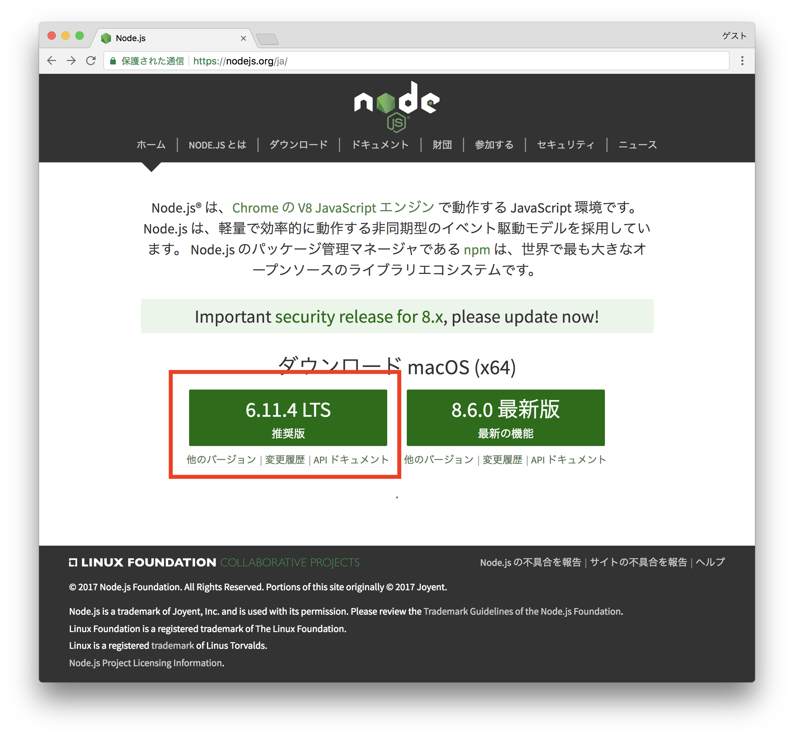
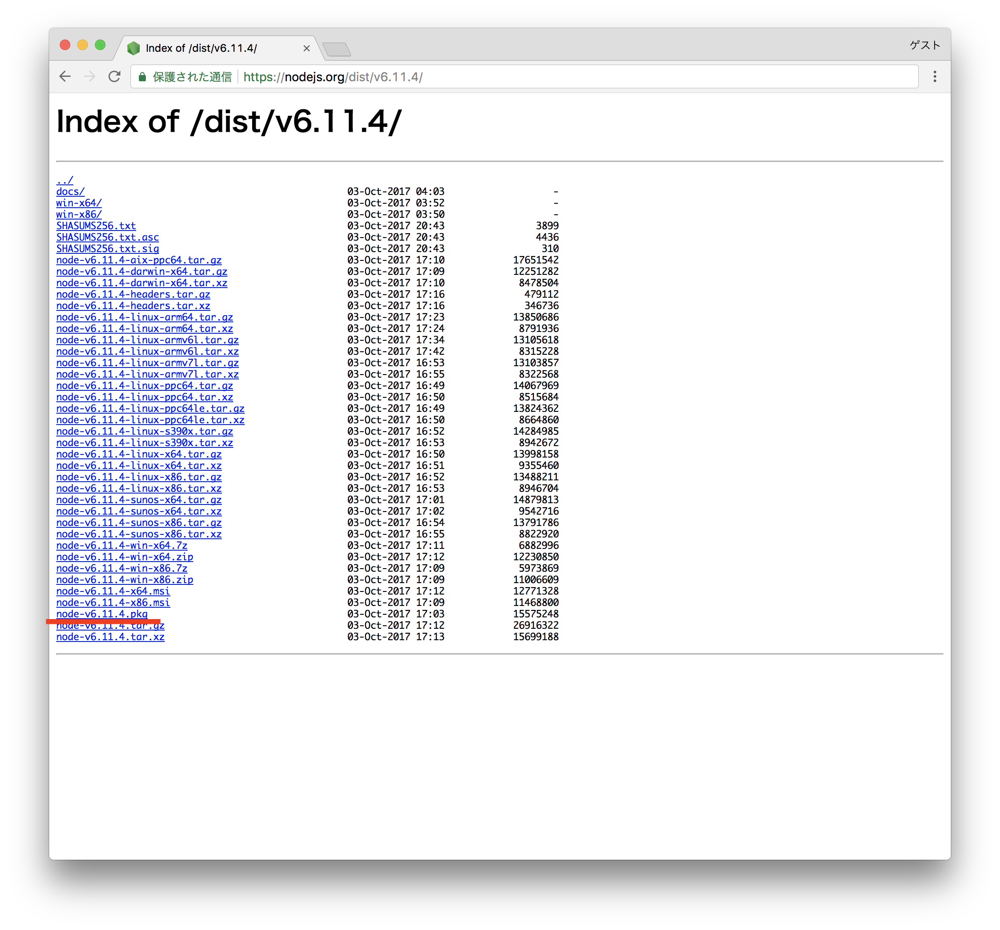
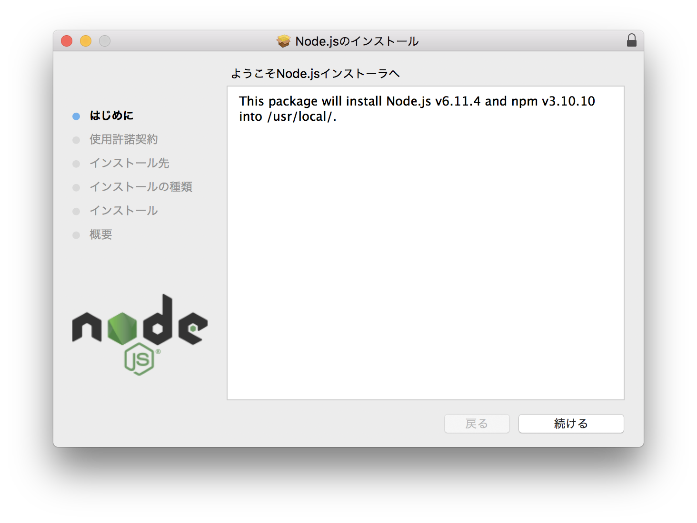
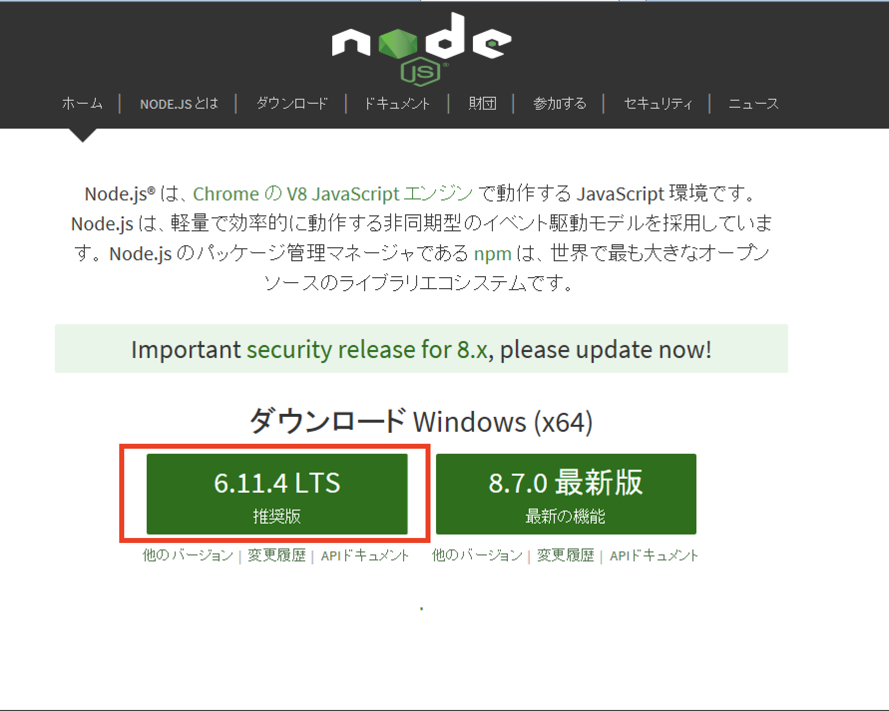
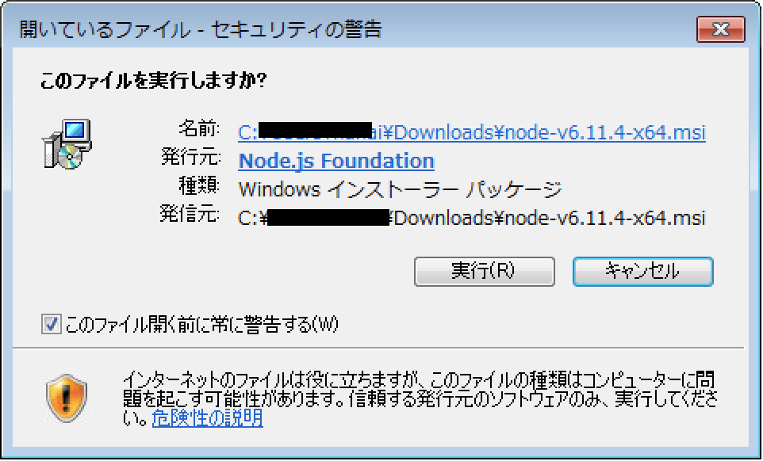
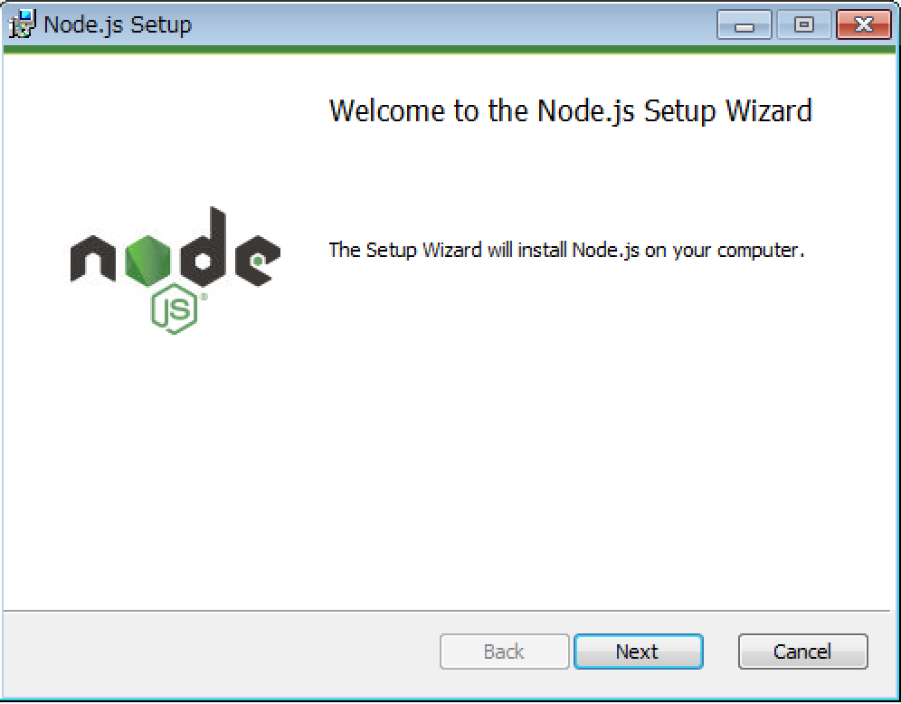

<!-- vim: set nofoldenable: -->

# 事前準備

会場のWiFi環境が悪い可能性もありますので、下記ソフトウェアを事前にインストールしてご参加ください。

- Node.jsのインストール
- create-react-appのインストール
- （任意）yarnのインストール

## Node.jsのインストール

開発ツール等がnpmパッケージで公開されていますので、Node.js（と同梱されているnpm）のインストールが必須です。Node.jsのv6系（このドキュメントを記述していた時の最新は6.11.4）のインストールをお願いします。

### Macの場合

- Homebrewでインストールする
- インストーラーを使ってインストールする

#### Homebrewでインストールする

下記コマンドをコンソール上（Terminal.appやiTerm2）で実行してください。

```console
$ brew install node@6
```

`node -v`、`npm -v`を実行し、バージョンが表示されれば正常にインストールされています。

```console
$ node -v
v6.11.4

$ npm -v
3.10.10
```

ついでに、npmのバージョンを最新にしておきましょう。

```console
$ npm install -g npm
...

$ npm -v
5.4.2
```

#### インストーラーを使ってインストールする

Node.jsのサイトにアクセスします。

https://nodejs.org/ja/

左側の「6.XX.X LTS 推奨版」と書いている緑色のボタン（リンク）を押します。「node-v6.XX.X.pkg」（XX.Xの部分にはバージョン番号が入ります）のダウンロードが開始しされるはずです。


もし、下記のファイル一覧ページに遷移した場合は、「node-v6.XX.X.pkg」のリンクをクリックしてください。



「node-v6.XX.X.pkg」を開くとインストーラーが起動しますので、あとはインストーラーの表示したがって進めればインストール完了です。



下記コマンドをコンソール上（Terminal.appやiTerm2）で実行し、バージョンが表示されれば正常にインストールが完了しています。

```console
$ node -v
v6.11.4

$ npm -v
3.10.10
```

ついでに、npmのバージョンを最新にしておきましょう。

```console
$ npm install -g npm
...

$ npm -v
5.4.2
```

### Windowsの場合

#### インストーラーを使ってインストールする

Node.jsのサイトにアクセスします。

https://nodejs.org/ja/

左側の「6.XX.X LTS 推奨版」と書いている緑色のボタン（リンク）を押します。「node-v6.XX.X-x64」（XX.Xの部分にはバージョン番号が入ります）という名前のWindowsインストーラーパッケージのダウンロードが開始しされるはずです。



インストーラーを実行します。



あとは、インストーラーに従って進めていけばよいです（デフォルトのままでOKなので、「Next」を押していけば大丈夫だと思います）



<br>
<br>

## create-react-appのインストール

ceate-react-appとは、React.jsのプロジェクトテンプレートを簡単に構築できるツールです。公式（Facebook）が出しているツールです。ハンズオンではcreate-react-appを用いてアプリケーションを構築していきますので、インストールをお願いします。

https://github.com/facebookincubator/create-react-app

create-react-appは、npmパッケージとして公開されていますので、下記のコマンドを実行するとインストールできます。

```console
# create-react-appのインストール
$ npm install --global create-react-app

# 正常にインストールされているかの確認
$ create-react-app --version
1.4.1
```

<br>
<br>

## （任意）yarnのインストール

yarnとは、ざっくりと説明しますと、Facebookが開発しているnpmコマンドの速い版です。インストールするかは任意になりますが、ハンズオン中にnpmパッケージを幾つか追加していただくときに、npmコマンドよりも速く実行できます。

https://yarnpkg.com/en/

インストールについては、下記ドキュメントを御覧ください。macOSに関してはHomebrewなど、Windowsに関してはインストーラーが提供されています。

