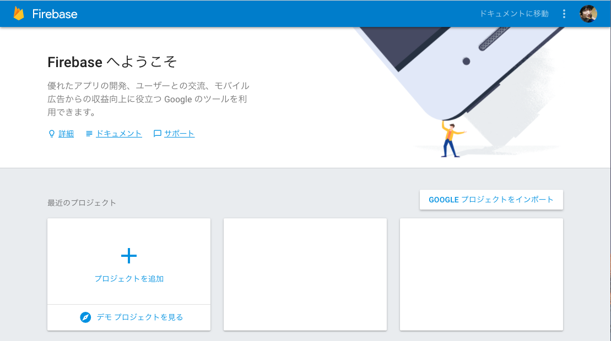
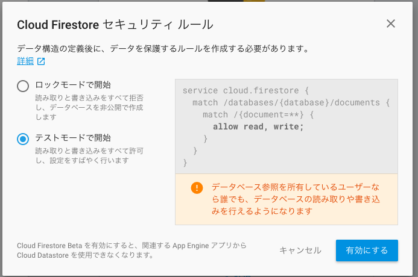

# firebaseを使う

firebaseを使って、下記を実現しましょう

- Googleアカウントでログイン出来るようにする
- チャットのデータを永続的に保存する

## 手順

1. firebaseのコンソールにログインし、プロジェクトを作成する
1. GoogleアカウントによるSNS認証を有効化する
1. firestoreを有効化し、データの書き込み・読み込みを許可する
1. firebase-utilsをインストールし、CLIからログインする
1. ログイン機能を実装する
1. 部屋情報、チャット情報をfirestoreに保存し、読み出す

### firebaseのコンソールにログインし、プロジェクトを作成する

https://firebase.google.com/?hl=ja

上記URLにアクセスし、右上の「GO TO CONSOLE」をクリックします。
「Firebaseへようこそ」の画面にたどり着いたら、「プロジェクトを追加」のボタンを押します。

「プロジェクトを作成」というダイアログが出ますので、プロジェクト名は適当、国/地域は「日本」を入力し、【プロジェクトを作成」ボタンを押します。

下記画面が表示されれば、プロジェクト作成完了です。
「ウェブアプリに Firebase を追加」を押すと、firebaseの認証情報が表示されます（あとで使います）

### GoogleアカウントによるSNS認証を有効化する

デフォルトでは無効になっているので、コンソールから有効にします。さきほど作ったプロジェクトページを開きます。
左にメニューが表示されているので、「Authentication」をクリックします。

下記のような画面が表示されるので、タブの「ログイン方法」か、真ん中あたりに表示される「ログイン方法を設定」のボタンを押します。

「ログイン プロバイダ」の「Google」をクリックします。

ダイアログが開くので、「有効にする」のスイッチをオンにします。下記の画像がオンの状態です。

### firestoreを有効化し、データの書き込み・読み込みを許可する

プロジェクトページの左メニューの「Database」をクリックします。

下に表示される「FIRESTOREベータ版を試してみる」をクリックします

「Cloud Firestore セキュリティ ルール」というダイアログが表示されるので「テストモードで開始」を選択し、「有効にする」ボタンをクリックします。

下記の画面に遷移したら完了です。ちなみに、この画面が登録されているデータの確認や、データの入力が行なえます。デバッグに便利です。

